<p align="center">
  
</p>

<h1 align="center">Apiary</h1>

<p align="center">
  <strong>Claude Code Multi-Session Manager</strong><br/>
  A terminal UI for orchestrating multiple Claude Code sessions from a single dashboard.
</p>

<p align="center">
  <a href="https://www.rust-lang.org/"></a>
  <a href="LICENSE"></a>
  <a href="https://github.com/tmux/tmux"></a>
</p>

---

<p align="center">
  
</p>

<details>
<summary><strong>Swarm Demo</strong> -- Multi-Team-Pod orchestration with two-tier hierarchy</summary>
<p align="center">
  
</p>
</details>

## Features

- **Pod Model** -- Every session is a Pod. Solo Pods run a single agent; Team Pods coordinate N members with automatic teammate discovery.
- **Dynamic Discovery** -- New Pods and team members appear in the TUI automatically as they are created, without restart.
- **Real-Time State Detection** -- Monitors each session via `capture-pane` and regex pattern matching, detecting states like Working, Idle, Permission, Error, and Done.
- **Permission Control** -- Approve or deny tool-use permission requests directly from the TUI without switching windows.
- **Chat Mode** -- Talk to any agent inline. Messages are sent with `send-keys` and responses are captured via diff detection.
- **Agent Teams** -- Automatically discovers teammates in multi-agent setups and renders a two-tier hierarchy.
- **Adaptive Polling** -- Dynamically adjusts polling intervals based on each Pod's current state to balance responsiveness and resource usage.
- **CLI Subcommands** -- Create, adopt, drop, list, and inspect Pods without entering the TUI.
- **Git Worktree Integration** -- Optionally create a Git worktree alongside each Pod for isolated branch work.
- **Configuration File** -- Customize polling intervals, detection patterns, and notifications via `~/.config/apiary/config.toml`.
- **Hooks Integration** -- Leverage Claude Code hooks for real-time state updates pushed directly to Apiary.

## Quick Start

### Install

```sh
cargo install apiary
```

### Requirements

| Dependency | Version | Required |
|------------|---------|----------|
| **Rust** | 2021 edition | Yes |
| **tmux** | >= 3.2 | Yes |
| **Claude Code** | latest | Yes |
| **git** | any | Optional (worktree support) |

### Launch

```sh
apiary
```

## Usage

### TUI

Run `apiary` with no arguments to open the dashboard. The interface is split into two panels:

```
+---------------------+-------------------------------+
|   Context Panel     |         Pods Grid             |
|       (35%)         |           (65%)               |
|                     |                               |
|  Pod details,       |  +-------+  +-------+        |
|  member info,       |  | Pod A |  | Pod B |        |
|  state history      |  |Working|  | Idle  |        |
|                     |  +-------+  +-------+        |
|                     |                               |
|                     |  +-------+  +-------+        |
|                     |  | Pod C |  | Pod D |        |
|                     |  | Error |  | Done  |        |
|                     |  +-------+  +-------+        |
+---------------------+-------------------------------+
```

**Modes**: Home | Detail | Chat | Permission | Help

### CLI

```sh
# Launch the TUI
apiary

# Create a new Pod (optionally with a git worktree)
apiary create <name> [--worktree <path>]

# Adopt an existing tmux session as a Pod
apiary adopt <session> [--name <name>]

# Remove a Pod
apiary drop <name>

# List all Pods
apiary list

# Show a status summary
apiary status
```

## Keyboard Shortcuts

| Key | Action |
|-----|--------|
| `Arrow keys` / `h j k l` | Move cursor between Pods |
| `Enter` | Open Pod detail view |
| `Esc` | Return to previous mode |
| `c` | Enter Chat mode |
| `n` | Jump to the next Pod with a warning |
| `a` / `d` | Approve / Deny a permission request |
| `s` | Skip a permission request |
| `/` | Open command input |
| `?` | Show help |
| `q` | Quit |

## Configuration

Apiary reads its configuration from `~/.config/apiary/config.toml`. All fields are optional and fall back to sensible defaults.

```toml
[polling]
focused_interval_ms = 1000      # Interval when Pod is focused
permission_interval_ms = 1000   # Interval when a permission prompt is detected
working_interval_ms = 3000      # Interval when agent is actively working
idle_interval_ms = 10000        # Interval when agent is idle
error_interval_ms = 5000        # Interval when agent is in error state

[notification]
enabled = true                  # Desktop notifications on state changes
sound = false                   # Audible alerts

[detection]
permission_patterns = []        # Extra regex patterns for permission prompts
error_patterns = []             # Extra regex patterns for error detection
idle_patterns = []              # Extra regex patterns for idle detection
```

## Architecture

```
                          apiary (TUI / CLI)
                                 |
               +-----------------+-----------------+
               |                                   |
         +-----+------+                    +-------+-------+
         |  Pod Store |                    |  tmux Layer   |
         | (JSON file)|                    | (capture-pane,|
         +-----+------+                    |  send-keys)   |
               |                           +-------+-------+
               |                                   |
        +------+------+           +----------------+----------------+
        | Config      |           |                |                |
        | (.toml)     |     +-----+----+    +------+-----+   +-----+-----+
        +-------------+     | Detector |    | Discovery  |   |   Hooks   |
                            | (regex)  |    | (teammates)|   | (CC hooks)|
                            +----------+    +------------+   +-----------+
```

**Data flow**: The TUI main loop polls each Pod's tmux pane, feeds the captured output through the Detector (regex pattern matching), updates the Pod state in the Store, and re-renders the UI. Chat mode sends keystrokes via `send-keys` and detects responses through output diffs. The Hooks module provides an alternative push-based path for state updates.

## Project Structure

```
src/
├── main.rs            # Entry point, CLI argument parsing, TUI main loop
├── config.rs          # Configuration file management (~/.config/apiary/config.toml)
├── hooks.rs           # Claude Code hooks integration
├── notify.rs          # Desktop notification support
├── pod/
│   ├── mod.rs         # Core data models: Pod, Member, AppState
│   ├── detector.rs    # State detection via regex pattern matching
│   └── discovery.rs   # Automatic teammate discovery for Agent Teams
├── store/
│   └── mod.rs         # Pod persistence (JSON-based storage)
├── tmux/
│   └── mod.rs         # tmux CLI wrapper (capture-pane, send-keys, etc.)
└── tui/
    ├── mod.rs         # TUI module root
    ├── app.rs         # Application state and logic
    ├── handler.rs     # Keyboard and event handling
    └── ui.rs          # UI rendering with ratatui
```

## Contributing

Contributions are welcome! Please open an issue or submit a pull request.

1. Fork the repository
2. Create a feature branch (`git checkout -b feature/my-feature`)
3. Commit your changes (`git commit -am 'Add my feature'`)
4. Push to the branch (`git push origin feature/my-feature`)
5. Open a Pull Request

## License

This project is licensed under the [MIT License](LICENSE).
